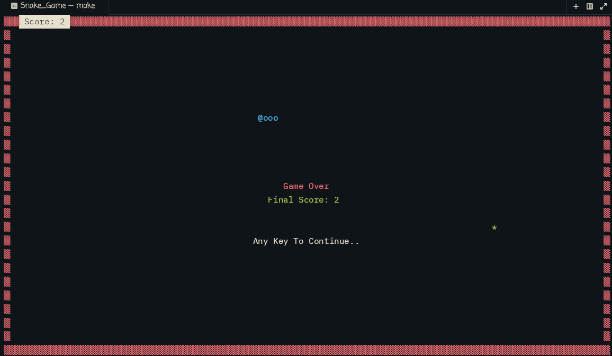

# Snake_Game

Created in C for terminal in Linux based system. (Should work the same in mac and windows)

How it looks:

## Controls:
- **WASD** / **Arrows**: Movement
- *Q*: Quit Game

## Post Notes:
- Used ncurses library to handle terminal rendering
- Found no fix to line spacing in terminals (Contact me if you find solution, though no one is probably reading this T-T)

## Relevant Files:
- app.c
- macros.h
- structures.h
- Makefile
